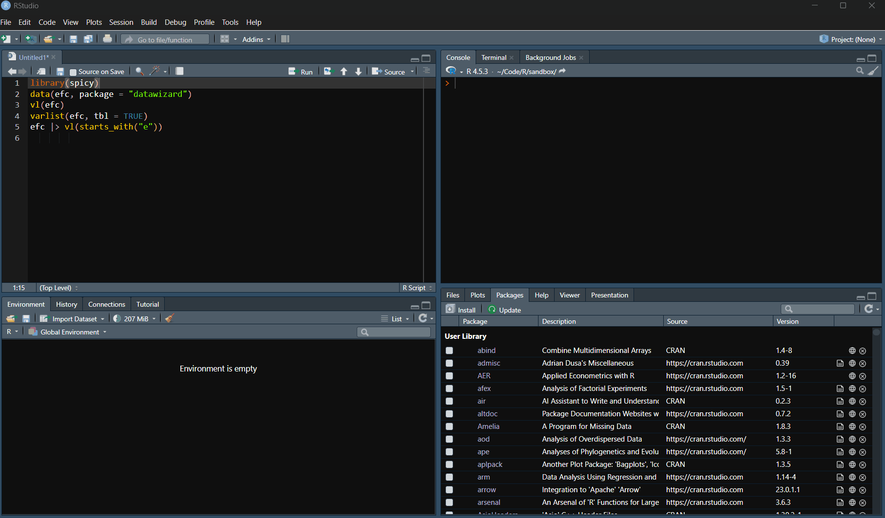

# spicy <a href="https://amaltawfik.github.io/spicy/"></a>

<!-- badges: start -->

[](https://CRAN.R-project.org/package=spicy)
[](https://amaltawfik.r-universe.dev/spicy)
[](https://github.com/amaltawfik/spicy/actions/workflows/R-CMD-check.yaml)
[](https://github.com/amaltawfik/spicy/actions/workflows/rhub.yaml)
[](https://app.codecov.io/gh/amaltawfik/spicy)
[](https://www.repostatus.org/#active)
[](https://opensource.org/licenses/MIT)
[](https://doi.org/10.5281/zenodo.15397865)
[](https://cranlogs.r-pkg.org/badges/grand-total/spicy)
<!-- badges: end -->

spicy brings polished, console-first data exploration to R for everyday
analysis workflows.

## What is spicy?

spicy is an R package for descriptive statistics and data analysis,
designed for data science and survey research workflows. It covers
variable inspection, frequency tables, cross-tabulations with
chi-squared tests and effect sizes, and publication-ready APA-style
reporting — offering functionality similar to Stata or SPSS but within a
tidyverse-friendly R environment. It helps you:

- **Inspect variables** with `varlist()` — names, labels, values,
  classes, missings. Similar to SPSS “Variable View” or Stata “Variables
  Manager”.
- **Explore distributions** with `freq()` and associations with
  `cross_tab()`.
- **Measure associations** with `cramer_v()`, `phi()`, `gamma_gk()`,
  `kendall_tau_b()`, `somers_d()`, and more — all with confidence
  intervals and p-values.
- **Build APA tables** with `table_apa()` — export to gt, tinytable,
  flextable, Excel, Word, or clipboard.
- **Compute row-wise summaries** with `mean_n()`, `sum_n()`, and
  `count_n()`.
- **Generate codebooks** with `code_book()` — interactive HTML with
  search, sort, and export.
- **Extract labels** from column headers with `label_from_names()` —
  useful for LimeSurvey CSV exports.

Works with `labelled`, `factor`, `ordered`, `Date`, `POSIXct`, and other
common variable types. See `vignette("spicy")` for a full tour.

------------------------------------------------------------------------

## Installation

Install the stable version from CRAN:

``` r
install.packages("spicy")
```

Or from [r-universe](https://amaltawfik.r-universe.dev/spicy):

``` r
install.packages("spicy", repos = c("https://amaltawfik.r-universe.dev", "https://cloud.r-project.org"))
```

Or the development version from GitHub:

``` r
# install.packages("pak")
pak::pak("amaltawfik/spicy")
```

------------------------------------------------------------------------

## Quick tour

### Inspect variables



``` r
varlist(sochealth, tbl = TRUE)
#> # A tibble: 24 × 7
#>    Variable          Label                 Values Class N_distinct N_valid   NAs
#>    <chr>             <chr>                 <chr>  <chr>      <int>   <int> <int>
#>  1 sex               Sex                   Femal… fact…          2    1200     0
#>  2 age               Age (years)           25, 2… nume…         51    1200     0
#>  3 age_group         Age group             25-34… orde…          4    1200     0
#>  4 education         Highest education le… Lower… orde…          3    1200     0
#>  5 social_class      Subjective social cl… Lower… orde…          5    1200     0
#>  6 region            Region of residence   Centr… fact…          6    1200     0
#>  7 employment_status Employment status     Emplo… fact…          4    1200     0
#>  8 income_group      Household income gro… Low, … orde…          4    1182    18
#>  9 income            Monthly household in… 1000,… nume…       1052    1200     0
#> 10 smoking           Current smoker        No, Y… fact…          2    1175    25
#> # ℹ 14 more rows
```

### Frequency tables and cross-tabulations

``` r
freq(sochealth, income_group)
#> Frequency table: income_group
#> 
#>  Category │ Values        Freq.  Percent  Valid Percent 
#> ──────────┼─────────────────────────────────────────────
#>  Valid    │ Low             247     20.6           20.9 
#>           │ Lower middle    388     32.3           32.8 
#>           │ Upper middle    328     27.3           27.7 
#>           │ High            219     18.2           18.5 
#>  Missing  │ NA               18      1.5                
#> ──────────┼─────────────────────────────────────────────
#>  Total    │                1200    100.0          100.0 
#> 
#> Label: Household income group
#> Class: ordered, factor
#> Data: sochealth

cross_tab(sochealth, smoking, education, percent = "col")
#> Crosstable: smoking x education (Column %)
#> 
#>  Values      │      Lower secondary       Upper secondary       Tertiary │      Total 
#> ─────────────┼───────────────────────────────────────────────────────────┼────────────
#>  No          │                 69.6                  78.7           84.9 │       78.8 
#>  Yes         │                 30.4                  21.3           15.1 │       21.2 
#> ─────────────┼───────────────────────────────────────────────────────────┼────────────
#>  Total       │                100.0                 100.0          100.0 │      100.0 
#>  N           │                  257                   527            391 │       1175 
#> 
#> Chi-2(2) = 21.6, p < 0.001
#> Cramer's V = 0.14
```

### Association measures

``` r
tbl <- xtabs(~ self_rated_health + education, data = sochealth)

# Quick scalar estimate
cramer_v(tbl)
#> [1] 0.1761697

# Detailed result with CI and p-value
cramer_v(tbl, detail = TRUE)
#> Estimate  CI lower  CI upper        p
#>    0.176     0.120     0.231  < 0.001
```

See `vignette("association-measures")` for a guide on choosing the right
measure.

### APA tables

``` r
table_apa(
  sochealth,
  row_vars = c("smoking", "physical_activity"),
  group_var = "education",
  labels = c("Current smoker", "Physical activity"),
  output = "wide",
  style = "report"
)
#>            Variable Lower secondary n Lower secondary % Upper secondary n
#> 1    Current smoker                                                      
#> 2                No               179              69.6               415
#> 3               Yes                78              30.4               112
#> 4 Physical activity                                                      
#> 5                No               177              67.8               310
#> 6               Yes                84              32.2               229
#>   Upper secondary % Tertiary n Tertiary % Total n Total %      p Cramer's V
#> 1                                                         < .001        .14
#> 2              78.7        332       84.9     926    78.8                  
#> 3              21.3         59       15.1     249    21.2                  
#> 4                                                         < .001        .21
#> 5              57.5        163       40.8     650    54.2                  
#> 6              42.5        237       59.2     550    45.8
```

See `vignette("table-apa")` for all output formats, weights, CI, and
export options.

### Row-wise summaries

``` r
df <- data.frame(
  x1 = c(10, NA, 30, 40, 50),
  x2 = c(5, NA, 15, NA, 25),
  x3 = c(NA, 30, 20, 50, 10)
)

mean_n(df)
#> [1]       NA       NA 21.66667       NA 28.33333
sum_n(df, min_valid = 2)
#> [1] 15 NA 65 90 85
count_n(df, special = "NA")
#> [1] 1 2 0 1 0
```

### Label extraction

``` r
# LimeSurvey-style headers: "code. label"
df <- tibble::tibble(
  "age. Age of respondent" = c(25, 30),
  "score. Total score" = c(12, 14)
)
out <- label_from_names(df)
labelled::var_label(out)
#> $age
#> [1] "Age of respondent"
#> 
#> $score
#> [1] "Total score"
```

------------------------------------------------------------------------

## Citation

If you use spicy in a publication or teaching material:

- Use `citation("spicy")` for the BibTeX entry.
- The archival DOI is: <https://doi.org/10.5281/zenodo.15397865>.
- Source citation file:
  <https://github.com/amaltawfik/spicy/blob/main/inst/CITATION>

------------------------------------------------------------------------

## License

MIT. See [`LICENSE`](LICENSE) for details.
