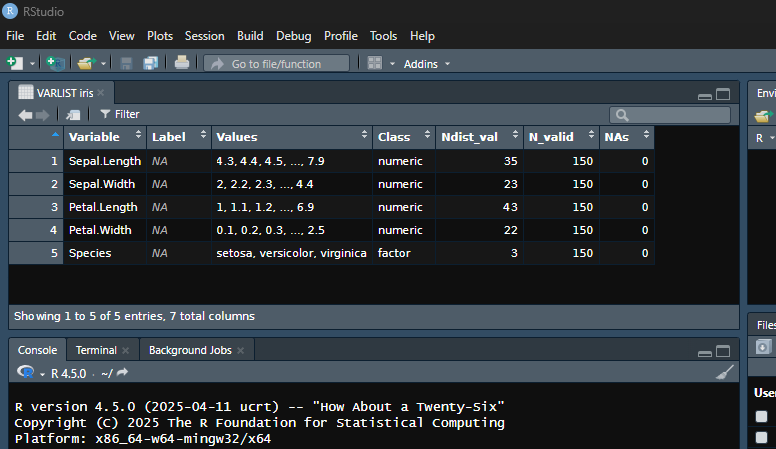

# spicy <a href="https://amaltawfik.github.io/spicy/"></a>

<!-- badges: start -->

[](https://CRAN.R-project.org/package=spicy)
[](https://cranlogs.r-pkg.org/badges/grand-total/spicy)
[](https://github.com/amaltawfik/spicy/releases)
[](https://github.com/amaltawfik/spicy/actions/workflows/R-CMD-check.yaml)
[](https://www.repostatus.org/#active)
[](https://opensource.org/licenses/MIT)
[](https://doi.org/10.5281/zenodo.15397865)
<!-- badges: end -->

spicy is designed to make variable exploration and descriptive
statistics fast, expressive, and easy to use.

## What is spicy?

spicy is an R package for quick, consistent, and elegant exploration of
data frames. It helps you:

- Extract variable metadata and display compact summaries of dataset
  variables using `varlist()` (with `vl()` as a convenient shortcut),
  including names, labels, values, classes, number of distinct
  non-missing values, number of valid observations, number of missing
  observations. Similar to the “Variable View” in SPSS or the “Variables
  Manager” in Stata.
- Compute frequency tables with `freq()`, row-wise means with
  `mean_n()`, row-wise sums with `sum_n()`, and counts of specific
  values using `count_n()` — all with automatic handling of missing
  data.
- Explore relationships between categorical variables using
  `cross_tab()` for contingency tables and `cramer_v()` for association
  strength.
- Copy data frames or result tables directly to the clipboard using
  `copy_clipboard()` for fast export to spreadsheets or text editors.
- Extract and assign variable labels from column headers with
  `label_from_names()`, especially useful for LimeSurvey CSV exports
  where headers follow the `"name. label"` convention.
- Handle `labelled`, `factor`, `Date`, `POSIXct`, and other commonly
  used variable types.

All with intuitive functions that return clean, structured outputs.

------------------------------------------------------------------------

## Installation

For the stable version, install from CRAN.

``` r
install.packages("spicy")
```

You can install the development version of spicy from GitHub with:

``` r
# install.packages("pak")
pak::pak("amaltawfik/spicy")
```

------------------------------------------------------------------------

## Example usage

Here are some quick examples using built-in datasets:

``` r
library(spicy)
library(dplyr)

# Get a summary of all variables in the Viewer
varlist(iris)
```



``` r
# Get a summary of the variables that start with "d" in the Viewer
# Asterisks (*) in the title indicate that the data frame has been subsetted
vl(mtcars, starts_with("d"))
```


``` r
# Get a summary of all variables as a tibble
varlist(iris, tbl = TRUE)
#> # A tibble: 5 × 7
#>   Variable     Label Values                        Class Ndist_val N_valid   NAs
#>   <chr>        <chr> <chr>                         <chr>     <int>   <int> <int>
#> 1 Sepal.Length <NA>  4.3, 4.4, 4.5, ..., 7.9       nume…        35     150     0
#> 2 Sepal.Width  <NA>  2, 2.2, 2.3, ..., 4.4         nume…        23     150     0
#> 3 Petal.Length <NA>  1, 1.1, 1.2, ..., 6.9         nume…        43     150     0
#> 4 Petal.Width  <NA>  0.1, 0.2, 0.3, ..., 2.5       nume…        22     150     0
#> 5 Species      <NA>  setosa, versicolor, virginica fact…         3     150     0

# Tabulate frequencies with sort alphabetically (Z-A)
freq(iris, Species, sort = "name-")
#> Frequency table: Species
#> ────────────────────────────
#>  Values       N     % Valid%
#> ────────────────────────────
#>  virginica   50  33.3   33.3
#>  versicolor  50  33.3   33.3
#>  setosa      50  33.3   33.3
#>  Total      150 100.0  100.0
#> ────────────────────────────
#> Class: factor
#> Data: iris

# Cross-tab with column percentages
cross_tab(mtcars, cyl, gear)
#> Crosstable: cyl x gear (%)
#> ─────────────────────────────────────────
#>  Values           3     4     5 Row_Total
#> ─────────────────────────────────────────
#>  4              6.7  66.7  40.0      34.4
#>  6             13.3  33.3  20.0      21.9
#>  8             80.0   0.0  40.0      43.8
#>  Column_Total 100.0 100.0 100.0     100.0
#>  N             15.0  12.0   5.0      32.0
#> ─────────────────────────────────────────
#> Chi-2 = 18 (df = 4), p = 0.00121, Cramer's V = 0.53

# Cross-tab with row percentages
cross_tab(mtcars, cyl, gear, rowprct = TRUE)
#> Crosstable: cyl x gear (%)
#> ─────────────────────────────────────────
#>  Values          3    4    5 Row_Total  N
#> ─────────────────────────────────────────
#>  4             9.1 72.7 18.2     100.0 11
#>  6            28.6 57.1 14.3     100.0  7
#>  8            85.7  0.0 14.3     100.0 14
#>  Column_Total 46.9 37.5 15.6     100.0 32
#> ─────────────────────────────────────────
#> Chi-2 = 18 (df = 4), p = 0.00121, Cramer's V = 0.53

# Cross-tab with column percentages grouped by a single variable
cross_tab(mtcars, cyl, gear, by = am)
#> $`0`
#> Crosstable: cyl x gear | am = 0 (%)
#> ───────────────────────────────────
#>  Values           3     4 Row_Total
#> ───────────────────────────────────
#>  4              6.7  50.0      15.8
#>  6             13.3  50.0      21.1
#>  8             80.0   0.0      63.2
#>  Column_Total 100.0 100.0     100.0
#>  N             15.0   4.0      19.0
#> ───────────────────────────────────
#> Chi-2 = 9 (df = 2), p = 0.0113, Cramer's V = 0.69
#> 
#> $`1`
#> Crosstable: cyl x gear | am = 1 (%)
#> ───────────────────────────────────
#>  Values           4     5 Row_Total
#> ───────────────────────────────────
#>  4             75.0  40.0      61.5
#>  6             25.0  20.0      23.1
#>  8              0.0  40.0      15.4
#>  Column_Total 100.0 100.0     100.0
#>  N              8.0   5.0      13.0
#> ───────────────────────────────────
#> Chi-2 = 3.8 (df = 2), p = 0.146, Cramer's V = 0.54

# Compute row-wise mean/sum (all values must be valid by default) or specific value
df <- data.frame(
  var1 = c(10, NA, 30, 40, 50),
  var2 = c(5, NA, 15, NA, 25),
  var3 = c(NA, 30, 20, 50, 10)
)
df
#>   var1 var2 var3
#> 1   10    5   NA
#> 2   NA   NA   30
#> 3   30   15   20
#> 4   40   NA   50
#> 5   50   25   10
mean_n(df)
#> [1]       NA       NA 21.66667       NA 28.33333
sum_n(df)
#> [1] NA NA 65 NA 85
count_n(df, count = 10)
#> [1] 1 0 0 0 1
count_n(df, special = "NA")
#> [1] 1 2 0 1 0
df |> mutate(count30 = count_n(count = 30))
#>   var1 var2 var3 count30
#> 1   10    5   NA       0
#> 2   NA   NA   30       1
#> 3   30   15   20       1
#> 4   40   NA   50       0
#> 5   50   25   10       0
```

> All functions can be directly used in pipelines.

------------------------------------------------------------------------

## Why use `spicy`?

- Clean, expressive output  
- Works well with labelled survey data  
- Handles weights, percentages, NA counts  
- Great for exploring data and variables, teaching, or reporting

------------------------------------------------------------------------

## Citation

If you use `spicy` in a publication or teaching material, please cite it
as:

> Tawfik, A. (2025). *spicy: Tools for Data Management and Variable
> Exploration* (Version 0.1.0) \[R package\].
> <https://doi.org/10.5281/zenodo.15397865>

You can also get the citation in R format by typing:

``` r
citation("spicy")
```

Or [download the BibTeX citation](inst/citation.bib) directly.

------------------------------------------------------------------------

## License

This package is licensed under the MIT license. See [`LICENSE`](LICENSE)
for details.
